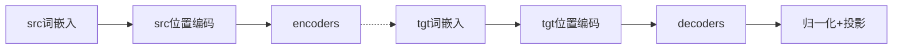

# dnn
## 说明
- 最简单，最基础的神经网络模型，可以做回归任务，可以做分类任务；
- 核心公式：activation(np.dot(x, weights) + biases)

## 一些基础概念
- activation是激活函数，目的是引入非线性，常见的有ReLU，sigmoid等；
- 激活函数是对矩阵每一项都进行，譬如，一个矩阵是2 * 3 * 10，则60个数都要过激活函数；

# rnn
## 计算公式
h_t = tanh(W_xh·x_t + W_hh·h_prev + b_h)

y_t = W_hy·h_t + b_y

## 公式解释
- 串行计算，例如["机", "器", "学", "习", "趣"]，现输入"机"进行计算，再计算"器"......
- 模型输入包括要处理的字(x_t)，例如，"机"，"器"；也要输入隐藏状态(h_prev)，分别用矩阵w_xh，w_hh进行计算；
- h_t是隐藏状态，是下一次输入的h_prev；
    隐藏状态是随着序列推进不断 “累积” 上下文，是 RNN 能理解 “前后文关系” 的核心

    t=0（输入 “我”）：h_0 包含 “我” 的信息；

    t=1（输入 “喜欢”）：h_1 融合了 “我” 和 “喜欢” 的信息；

    t=2（输入 “机器”）：h_2 融合了 “我”“喜欢”“机器” 的信息；

- y_t是输出，即我们要计算的目标；在预测任务中，y_t就是输出的概率，譬如我们的词典共有n个词，则y_t是一个n维向量，其中分最高的那一维，就是这一次的预测结果；
- 若输入是 “我 喜欢 机器”，t=4的h_4包含 “我喜欢机器” 的信息，假设接下来很可能预测到"学"，则y_t是一个向量，向量中代表"学"的那一维，得分最高；
- 贪心算法中，将每个t时刻得分最高的预测结果连起来，就是最终的结果；

# lstm
## 核心原理说明
- rnn的升级版，rnn仅有一套w_xh，w_hh，lstm有四套，作用分别是遗忘门，输入门，输出门，细胞候选状态；
- 代码
  ```python
    def forward(self, x: np.ndarray, h_prev: np.ndarray, c_prev: np.ndarray) -> tuple[np.ndarray, np.ndarray, np.ndarray]:
        i = sigmoid(np.dot(self.W_xi, x) + np.dot(self.W_hi, h_prev) + self.b_i)
        f = sigmoid(np.dot(self.W_xf, x) + np.dot(self.W_hf, h_prev) + self.b_f)
        o = sigmoid(np.dot(self.W_xo, x) + np.dot(self.W_ho, h_prev) + self.b_o)
        c_tilde = np.tanh(np.dot(self.W_xc, x) + np.dot(self.W_hc, h_prev) + self.b_c)
      """
        i，f，o，分别用于获得输入门，遗忘门和输出门；
        c_tilde是信息载体, 前边的ifo都是门，只有这个是可能被写入细胞状态的 “候选内容”；
      """
  
        c = f * c_prev + i * c_tilde
      """
        f 乘以 长期记忆(c_prev), i乘以当前信息载体(c_tilde),这个c是保留长期记忆的；
        遗忘prev，输入c_tilde；
      """
  
        h = o * np.tanh(c) # 有多少信息需要被 “提取” 到隐藏状态h，用于当前的输出 y，这个h是保留短期记忆的；
        y = np.dot(self.W_hy, h) + self.b_y #获取最终输出为y
        y = softmax(y.T)
        return y, h, c

    for t in range(seq_len): #遍历整个seq_len
        x_t = x_seq[t].T
        y_t, h, c = self.forward(x_t, h, c)
        outputs.append(y_t)`
    ```
## QA
- 为什么forward函数中，门都用激活函数sigmoid，信息载体用tanh

    sigmoid 的输出范围是 (0, 1)，适合做开关，tanh 的输出范围是 (-1, 1)，且以 0 为中心，适合表示信息载体；
  
- h_prev和c_prev的区别和联系是什么?

  h_prev是上一时间步隐藏状态，短期记忆，变化较快；们信号和候选信息直接依赖于h_prev；

  c_prev是上一时间步细胞状态，长期记忆，变化较慢；

  h = o * np.tanh(c)，h_prev是从c_prev中计算得到的，更能表示最近信息的状态信息；
  
 
# transformer 
## 关于模拟计算
- 本项目仅作示范，所有模型参数/矩阵未经过训练，用random_matrix随机生成一个矩阵；
- 模拟类翻译的seq2seq任务，源序列是src，目标序列是tgt，output是模型预测的结果；
- 训练阶段，tgt作为监督信号，用于更新loss；推理阶段，tgt就是已经生成的output，自回归生成；
- 通篇例子如下，我 爱 吃 火锅 -> I like to eat hot pot

## Transformer类
### 流程（forward函数）

### 词嵌入(Word Embedding)
- 将文字映射到高维空间，一般一个字/词会对应一个512(d_model)的向量;
- Word Embedding通过查表获取，但是权重也是需要学习的；
  
### 位置编码（PE）
- 目的是给序列加入位置信息，由于输入是 [seq_len, d_model]的向量，需要生成对应size的向量和输入相加；
- 计算方式：

  pe[pos, i] = math.sin(pos / (10000** (2*i / d_model)))
  
  pe[pos, i+1] = math.cos(pos / (10000 **(2*i / d_model)))

  其中pos是词的位置，如例中'吃'这个字，位置是3，则计算'吃'的PE时，这个pos就是3；i是Word Embedding的维度；

### LayerNorm
- 核心思想是对单个样本的特征维度进行归一化，使数据分布更稳定，从而加速训练并提升模型性;
- 单个样本是指，在d_model这个层面算均值方差这些；每个词嵌入都是自己内部归一化，"爱"和"吃"各自算各自的均值，和其他字没关系；
- 文本序列长度不固定，如果在batchNorm计算会受到padding的影响；
- 会在均值方差的基础上，加一点偏移，缩放之类的操作；

### FeedForward
- 两个标准的矩阵操作

  out1 = x @ self.w1 + self.b1  # 第一层：Linear + ReLU → [batch, seq, d_ff]

  out1 = np.maximum(out1, 0)  # ReLU激活

  out2 = out1 @ self.w2 + self.b2 # 第二层：Linear → [batch, seq, d_model]

### MultiHeadAttention
- 对输入x进行投影，得到q,k,v矩阵;
- scaled_dot_product

    scores = np.matmul(q, k.transpose(...)) / math.sqrt(d_k) # q,k本是(10, 256),计算后得到(10, 10)的矩阵

    attn_weights = np.exp(scores) / np.exp(scores).sum(axis=-1, keepdims=True) #softmax

    attn_output = np.matmul(attn_weights, v) # qk结果再乘以v

    ret = attn_out @ self.w_o #输出投影

- mask

  这里的mask是一个上三角矩阵，乘以负无穷，再和qk的结果相加；
  
- cross attention

  cross attention的k，v用encoder的输出，q用自己的；
  
### encoders
- 一般是多个encoder，encoder1的输出，作为encoder2的输入；
- 公式
  
  y_self = LayerNorm(self_attn(x) + x)
  
  ret = LayerNorm(FF(y_self) + y_self)

### decoders
- 一般是多个decoder，decoder1的输出，作为decoder2的输入；
- 公式
  
  y_self = LayerNorm(self_attn(x, mask) + x)
  
  y_cross = LayerNorm(cross_attn(y_self, enc_out) + y_self)
  
  ret = LayerNorm(FF(y_cross) + y_cross)
  
### 输出归一化+投影
- 对decoder的结果进行归一化，并投影到输出维度，(1, 15, 512) -> (1, 15, 10000)

# dnn trainer
## 说明
- 简单的dnn模型训练，用dnn来模拟函数，y = 3x² + 5
- 加入自制的criterion和optimizer;

## optimizer，adam
### 基本原理
- Adaptive ​Moment Estimation，自适应矩估计；
- 他的自适应主要体现在，​每个参数都有不同的、随时间调整的学习率；相比于sgd(全局用一个lr),在当时看起来很先进；
- sgd做法比较简单粗暴，weight -= learning_rate * grad
  
### 一阶矩，二阶矩
- 一阶矩(exp_avg),模拟动量，惯性；代表参数更新的主要方向；可以不严谨的理解为"行走的方向和决心";
- 二阶矩(exp_avg_sq), 模拟波动性，描述运动稳定性；如果波动性大，就小步更新，避免震荡；
- 一阶矩更新公式，exp_avg = beta1 * exp_avg + (1 - beta1) * grad；一般beta1数值较大，能更充分地继承历史信息，从而平滑短期噪声，捕捉梯度的长期趋势;
- 二阶矩更新公式，exp_avg_sq = beta2 * exp_avg_sq + (1 - beta2) * grad^2

### 公式
​- 参数更新公式：param = param - step_size * exp_avg / (sqrt(exp_avg_sq) + eps)
- exp_avg,exp_avg_sq,一阶矩，二阶矩;
- eps，数值稳定性常数，默认1e-8,分母中加入一个很小的数，避免除零;
- step_size = lr / bias_correction1，经过优化的学习率；
- bias_correction1 = 1 - beta1^t，修正一阶矩的偏差，在开始阶段，数值较小，于是修改，但t增大时，beta1^t 逐渐趋近于 0;

### 权重衰减，L2正则
- 时机:获取梯度后, 计算动量前;
- 作用:加入惩罚，避免过拟合;
- 
- L2正则公式，L_reg(θ) = L(θ) + λ/2 * ∑θ² (L(θ)是原始的损失函数，L_reg(θ)是正则后的损失函数，θ和p都表示模型参数)
- 求梯度(新损失函数对每个模型参数θi求偏导)时, 转换为: grad ← grad + λ ⋅ p,即, grad = grad.add(p.data, alpha=weight_decay)
- 为什么要加上模型参数p.data? 是为了是模型简单，模型不仅要使得grad尽可能的小，也要让参数平方和尽可能的小，进而在满足grad的前提下，尽可能的简单；
- 

### 参数说明 __init__(self, params, lr, betas=(0.9, 0.999), eps=1e-8, weight_decay=0)
- params: 待优化的参数迭代器（如model.parameters()）
- lr: 学习率（默认1e-3）
- betas: 一阶矩和二阶矩的指数衰减率（默认(0.9, 0.999)）,用于调节当前梯度和历史梯度的权重;
- eps: 数值稳定性常数，默认1e-8,分母中加入一个很小的数，避免除零;
- weight_decay: 权重衰减（L2正则化）系数;
