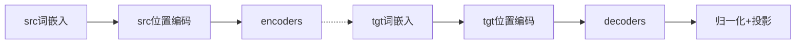

# dnn
## 说明
- 最简单,最基础的神经网络模型,可以做回归任务,可以做分类任务;
- 核心公式：activation(np.dot(x, weights) + biases)

## 一些基础概念
- activation是激活函数,目的是引入非线性,常见的有ReLU,sigmoid等;
- 激活函数是对矩阵每一项都进行,譬如,一个矩阵是2 * 3 * 10,则60个数都要过激活函数;

## 常见概念解析：mlp，线性层，fnn
- 线性层(Linear Layer),就是y = W · x + b；
- MLP(多层感知机，Multi-Layer Perceptron)，一个或多个线性层的叠加，线性层中加入activation；
- FFN(前馈网络，Feed-Forward Network)，含义和Mlp差不多，通常强调信息的单向流动；
- 在Transformer之后的文章中，常用FNN表示"输入 → 线性层1(升维) → activation → 线性层2(降维) → 输出"的结构；

# unet
## 概述
- 核心结构分为编码器（下采样）和解码器（上采样）
- 编码器，通过逐步下采样，增加通道数，从输入图像中提取特征，浅层输出**细节特征**，高层输出**语义特征**；
- 解码器，以编码器的高层语义特征（瓶颈层输出）为起点，通过逐步上采样恢复空间维度，同时通过**跳跃连接**融合编码器中同尺寸的低层细节特征;
- 解码器最终输出是融合了高层语义（“是什么”）和低层细节（“在哪里”）的**特征图**，该特征图与输入图像尺寸一致，可通过输出层（OutConv）转化为像素级分割结果；
- 最终输出为每个像素的标签，譬如，这个像素是属于天空，还是大地；

## down
### 操作过程
- 下采样，通过降低数据的维度（或采样密度），用更少的信息量（m 维，m<n）表示原始数据（n 维），从而减少数据量，但会丢失部分细节信息；
- nn.MaxPool2d(2)，是指用一个2X2的划窗过信息，一个原始长度是6X6的原始特征图，经过nn.MaxPool2d（2）后变成了3X3的特征图；
- DoubleConv，通过连续两次卷积操作，提供了强大的特征提取能力;是unet的基础砖块；
- MaxPool2d负责下采样，扩大感受野，DoubleConv负责提升将通道数翻倍；

      class Down(nn.Module):
          """下采样：MaxPool -> DoubleConv"""
          self.maxpool_conv = nn.Sequential(
              nn.MaxPool2d(2),
              DoubleConv(in_channels, out_channels)
          )

          def forward(self, x):
              return self.maxpool_conv(x)

### 特征理解
- 低层特征（编码器早期）：空间尺寸大，感受野小 → 侧重细节（边缘、纹理）；
- 高层特征（编码器后期 / 瓶颈层）：空间尺寸小，感受野大 → 侧重语义（类别、全局）；

## up
- 上采样并调整尺寸，同时将编码器和解码器特征进行拼接；
- 以上采样操作为主，基于编码器的高层特征，融合低层细节，逐步恢复空间维度，最终输出 “全局语义 + 局部细节” 的像素级标签；
  
        class Up(nn.Module):
          """上采样：反卷积/双线性插值 + 拼接 + DoubleConv"""
          def forward(self, x1, x2):
            x1 = self.up(x1) # 上采样并调整尺寸
            x1 = F.pad(...)
            x = torch.cat([x2, x1], dim=1) # 拼接编码器特征(x2)和解码器特征(x1)
            return self.conv(x)
  
## 代码
    def forward(self, x):
        # 编码器下采样，保存中间特征用于跳跃连接
        x1 = self.inc(x)       # 输入 -> 64通道
        x2 = self.down1(x1)    # 下采样1 -> 128通道
        x3 = self.down2(x2)    # 下采样2 -> 256通道
        x4 = self.down3(x3)    # 下采样3 -> 512通道
        x5 = self.down4(x4)    # 下采样4 -> 1024通道（瓶颈层）

        # 解码器上采样，拼接编码器特征
        x = self.up1(x5, x4)   # 上采样+拼接x4 -> 512通道
        x = self.up2(x, x3)    # 上采样+拼接x3 -> 256通道
        x = self.up3(x, x2)    # 上采样+拼接x2 -> 128通道
        x = self.up4(x, x1)    # 上采样+拼接x1 -> 64通道

       logits = self.outc(x) # 此处x是高维特征，logits是输出的类别概率图
       return logits

## QA
- 下采样为什么可以扩大感受野？通过模型聚合局部区域的特征，让特征图上的单个像素对应原始输入图像的更大区域；
- 什么是跳跃连接？

跳跃连接是**编码器输出的特征图**跳跃传递到解码器，与**解码器上采样的特征图**拼接，从而融合**高层语义特征**（来自解码器）和**底层细节特征**（来自编码器）

编码器在 “向下走” 的过程中记录局部细节（如底层特征，如边缘、纹理、精确位置）；解码器在 “向上爬” 的过程中生成 “全局语义结论”（高层特征，如 “这是一个器官”）；

# cnn
## 卷积理解
### 数学中的传统卷积
- 公式 (f∗g)(t)=∫ f(τ)⋅g(t−τ)dτ
- 理解 : 吃饭 + 消化,一个不稳定输入,和一个稳定的输出相乘,再做积分(离散函数就是相乘求和)
- 核心点 : 翻转,滑动,积分(相乘求和)
- 物理意义：一个输入信号(源函数,f)与一个表征 "局部作用范围和强度" 的函数(卷积核,g),在时间或空间上通过 "滑动叠加" 产生的累积效应;

### 机器学习中的卷积
- 输入特征图(H×W 矩阵),用离散卷积核(k×k 矩阵),滑动 + 离散求和;
- 目的,通过滑动窗口,提取局部有意义的表征;
- 这里省略了翻转步骤,是工程上的优化,直接用了翻转后的卷积核;

### 通道的理解
- 通道就是特征,输入通道数3,代表有3特征,输出通道是64,代表64种通道(可以理解为人像的肤色,发型等64个特征);
- 第一次输入时,input shape (2, 3, 224, 224) -> output shape (2, 64, 224, 224),3和64都是通道数;
- 上述操作将3个特征,每个特征的特征图包含224*224个点,转成了64个(224, 224);

### 感受野和卷积核
- 在单层卷积中,感受野就是卷积核的作用对象,两者大小相同,本例中卷积核为3 * 3 * 3;
- 多层卷积,第一层是3 * 3,第二层也是3 * 3,此时感受野必须满足两层的叠加,大小是5 * 5;
- 卷积核是 64 * 3 * 3 * 3, 就是每个通道都要做一遍卷积操作;
- 感受野（Receptive Field）是指特征图上的一个像素，在原始输入图像中所 “看到” 的区域范围；

### 池化层
- pooling这名字很奇怪,其实pooling,可以认为是把前边的资源汇聚,pooling这个单词也有整合资源的意思;
- Cnn的pooling就是把输入的大尺寸 Tensor,通过 "提取关键信息 + 压缩尺寸",变成更小的 Tensor;

### 为什么Cnn可以用于语音数据处理
语音的特点是，平稳连续；

传统的一维特征难以获得信息，于是通过fft得到二维的mel特征，用cnn可以获得mel特征的高维信息;

## 流程说明：
### 特征提取
  Conv2D → BatchNorm2D → ReLU → MaxPool2D → AdaptiveAvgPool2D
### 分类
  Flatten → Linear → ReLU → DropOut → Linear
  
  浓缩特征 → 扩展表达(升维,提升模型的表征能力) → 引入非线性 → 防过拟合 → 输出结果(分类器)

## 核心部件说明
### Conv2D
- 通过滑动窗口,将2维输入的局部特征浓缩成特征值;
- out_H = (输入高度H + 2×padding - 核尺寸kernel_size) // 步长stride + 1
- 代码如下
  ```python
  # 填充,即给原来的输入加上边;
  x_pad = np.pad(x, ((0,0), (0,0), (self.padding, self.padding), (self.padding, self.padding)), mode='constant') 
  out = np.zeros((batch, out_c, out_H, out_W)) #输出的buf,out_H,out_W是底层的像素转换后的二维向量的大小

  for b in range(batch):  # 遍历每个样本
    for c_out in range(out_c):  # 遍历每个输出通道
        for h in range(out_H):  # 遍历输出高度
            for w in range(out_W):  # 遍历输出宽度
                field = x_pad[b, :, h:h+kernel_size, w:w+kernel_size] # 提取当前位置的输入局部区域(感受野)
                # 卷积计算：感受野与卷积核相乘求和 + 偏置
                out[b, c_out, h, w] = np.sum(field * self.kernel[c_out]) + self.bias[c_out]
    ```
  
### BatchNorm2D
- momentum,即当前值乘以历史值,为了消除波动,计算running_mean,running_var;running_mean和running_var仅在推理时使用;
- 核心理解,np.mean(x, axis=(0, 2, 3)),即对0,2,3维的所有元素求平均,输入(2, 64, 224, 224),求平均之后得到64个mean;
- gamma和beta,对最后norm的结果乘以一个缩放指数,再加个bias;
- gamma和beta是可学习的,改变原来norm均值0, 方差1的分布,适应更多任务;

### MaxPool2D
- 作用：对特征图进行 "下采样"(降维),同时保留关键特征并增强模型的鲁棒性;
- 整体操作和Conv2d很像,都是滑窗计算;
- 操作区别在于,MaxPool2D没有卷积核,就是单纯的取max计算;同时不改变通道数;
- 目的区别在于,Conv2d为了提取新的特征,MaxPool2D没有卷积核为了降维,同时保留关键信息;
- 并非所有的cnn都需要池化层,有些在conv里调整步长,同样可以做到降维的作用;

### AdaptiveAvgPool2D
- 用空间维度的平均值代表该通道的整体特征,相当于对特征图做 "全局压缩",保留通道的整体强度信息;
  
### Flatten
- 作用：维度转换;
- 说明：全连接层(Linear)的输入必须是二维的 "特征向量"(形状为 (batch_size, 特征数)),因为全连接层的本质是 "全局加权求和",要求前一层的特征必须 "扁平化" (没有空间维度的区分);
- 它的输入,是池化层的输出;

### Linear
标准线性层,W * x + B

### DropOut
- 随机生成一个伯努利分布的mask,通过"随机掩码 + 缩放",实现,随机失活神经元防止过拟合,又保证训练与推理时的输出期望一致;
- 伯努利分布说明;

# rnn
## 计算公式
h_t = tanh(W_xh·x_t + W_hh·h_prev + b_h)

y_t = W_hy·h_t + b_y

## 公式解释
- 串行计算,例如["机", "器", "学", "习", "趣"],现输入"机"进行计算,再计算"器"......
- 模型输入包括要处理的字(x_t),例如,"机","器";也要输入隐藏状态(h_prev),分别用矩阵w_xh,w_hh进行计算;
- h_t是隐藏状态,是下一次输入的h_prev;
    隐藏状态是随着序列推进不断 "累积" 上下文,是 RNN 能理解 "前后文关系" 的核心

    t=0(输入 "我")：h_0 包含 "我" 的信息;

    t=1(输入 "喜欢")：h_1 融合了 "我" 和 "喜欢" 的信息;

    t=2(输入 "机器")：h_2 融合了 "我""喜欢""机器" 的信息;

- y_t是输出,即我们要计算的目标;在预测任务中,y_t就是输出的概率,譬如我们的词典共有n个词,则y_t是一个n维向量,其中分最高的那一维,就是这一次的预测结果;
- 若输入是 "我 喜欢 机器",t=4的h_4包含 "我喜欢机器" 的信息,假设接下来很可能预测到"学",则y_t是一个向量,向量中代表"学"的那一维,得分最高;
- 贪心算法中,将每个t时刻得分最高的预测结果连起来,就是最终的结果;

# lstm
## 核心原理说明
- rnn的升级版,rnn仅有一套w_xh,w_hh,lstm有四套,作用分别是遗忘门,输入门,输出门,细胞候选状态;
- 代码
  ```python
    def forward(self, x: np.ndarray, h_prev: np.ndarray, c_prev: np.ndarray) -> tuple[np.ndarray, np.ndarray, np.ndarray]:
        i = sigmoid(np.dot(self.W_xi, x) + np.dot(self.W_hi, h_prev) + self.b_i)
        f = sigmoid(np.dot(self.W_xf, x) + np.dot(self.W_hf, h_prev) + self.b_f)
        o = sigmoid(np.dot(self.W_xo, x) + np.dot(self.W_ho, h_prev) + self.b_o)
        c_tilde = np.tanh(np.dot(self.W_xc, x) + np.dot(self.W_hc, h_prev) + self.b_c)
      """
        i,f,o,分别用于获得输入门,遗忘门和输出门;
        c_tilde是信息载体, 前边的ifo都是门,只有这个是可能被写入细胞状态的 "候选内容";
      """
  
        c = f * c_prev + i * c_tilde
      """
        f 乘以 长期记忆(c_prev), i乘以当前信息载体(c_tilde),这个c是保留长期记忆的;
        遗忘prev,输入c_tilde;
      """
  
        h = o * np.tanh(c) # 有多少信息需要被 "提取" 到隐藏状态h,用于当前的输出 y,这个h是保留短期记忆的;
        y = np.dot(self.W_hy, h) + self.b_y #获取最终输出为y
        y = softmax(y.T)
        return y, h, c

    for t in range(seq_len): #遍历整个seq_len
        x_t = x_seq[t].T
        y_t, h, c = self.forward(x_t, h, c)
        outputs.append(y_t)`
    ```
## QA
- 为什么forward函数中,门都用激活函数sigmoid,信息载体用tanh

    sigmoid 的输出范围是 (0, 1),适合做开关,tanh 的输出范围是 (-1, 1),且以 0 为中心,适合表示信息载体;
  
- h_prev和c_prev的区别和联系是什么?

  h_prev是上一时间步隐藏状态,短期记忆,变化较快;们信号和候选信息直接依赖于h_prev;

  c_prev是上一时间步细胞状态,长期记忆,变化较慢;

  h = o * np.tanh(c),h_prev是从c_prev中计算得到的,更能表示最近信息的状态信息;
  
 
# transformer 
## 关于模拟计算
- 本项目仅作示范,所有模型参数/矩阵未经过训练,用random_matrix随机生成一个矩阵;
- 模拟类翻译的seq2seq任务,源序列是src,目标序列是tgt,output是模型预测的结果;
- 训练阶段,tgt作为监督信号,用于更新loss;推理阶段,tgt就是已经生成的output,自回归生成;
- 通篇例子如下,我 爱 吃 火锅 -> I like to eat hot pot

## Transformer类
### 流程(forward函数)

### 词嵌入(Word Embedding)
- 将文字映射到高维空间,一般一个字/词会对应一个512(d_model)的向量;
- Word Embedding通过查表获取,但是权重也是需要学习的;
  
### 位置编码(PE)
- 目的是给序列加入位置信息,由于输入是 [seq_len, d_model]的向量,需要生成对应size的向量和输入相加;
- 计算方式：

  pe[pos, i] = math.sin(pos / (10000** (2*i / d_model)))
  
  pe[pos, i+1] = math.cos(pos / (10000 **(2*i / d_model)))

  其中pos是词的位置,如例中'吃'这个字,位置是3,则计算'吃'的PE时,这个pos就是3;i是Word Embedding的维度;

### LayerNorm
- 核心思想是对单个样本的特征维度进行归一化,使数据分布更稳定,从而加速训练并提升模型性;
- 单个样本是指,在d_model这个层面算均值方差这些;每个词嵌入都是自己内部归一化,"爱"和"吃"各自算各自的均值,和其他字没关系;
- 文本序列长度不固定,如果在batchNorm计算会受到padding的影响;
- 会在均值方差的基础上,加一点偏移,缩放之类的操作;

### FeedForward
- 两个标准的矩阵操作

  out1 = x @ self.w1 + self.b1  # 第一层：Linear + ReLU → [batch, seq, d_ff]

  out1 = np.maximum(out1, 0)  # ReLU激活

  out2 = out1 @ self.w2 + self.b2 # 第二层：Linear → [batch, seq, d_model]

### MultiHeadAttention
- 对输入x进行投影,得到q,k,v矩阵;
- scaled_dot_product

    scores = np.matmul(q, k.transpose(...)) / math.sqrt(d_k) # q,k本是(10, 256),计算后得到(10, 10)的矩阵

    attn_weights = np.exp(scores) / np.exp(scores).sum(axis=-1, keepdims=True) #softmax

    attn_output = np.matmul(attn_weights, v) # qk结果再乘以v

    ret = attn_out @ self.w_o #输出投影

- mask

  这里的mask是一个上三角矩阵,乘以负无穷,再和qk的结果相加;
  
- cross attention

  cross attention的k,v用encoder的输出,q用自己的;
  
### encoders
- 一般是多个encoder,encoder1的输出,作为encoder2的输入;
- 公式
  
  y_self = LayerNorm(self_attn(x) + x)
  
  ret = LayerNorm(FF(y_self) + y_self)

### decoders
- 一般是多个decoder,decoder1的输出,作为decoder2的输入;
- 公式
  
  y_self = LayerNorm(self_attn(x, mask) + x)
  
  y_cross = LayerNorm(cross_attn(y_self, enc_out) + y_self)
  
  ret = LayerNorm(FF(y_cross) + y_cross)
  
### 输出归一化+投影
- 对decoder的结果进行归一化,并投影到输出维度,(1, 15, 512) -> (1, 15, 10000)

# gpt-3
## decoder-only说明
- 丢弃了transformer的encoder，保留decoder；
- 自回归的序列生成， 保留核心模块CausalSelfAttention(因果自注意力)；

## 模块说明
### ( q @ k.transpose() ) * v 理解
- 假设输入长度是10，qkv都是10 * dk的向量，q @ k.transpose()得到一个10 * 10的矩阵，其中第ij个元素，表示第i个词对第j个词的关注度；
- q @ k.transpose()，再乘以v，得到一个10 * dk的向量，尺寸和输入相同，但是这个向量已经包含了上下文感知的信息；
  
### CausalSelfAttention
- qkv_proj，将多头的qkv融合，假设，d_k(每个头的维度)=64, n_head=12，则qkv_proj的输出等于d_k * n_head * 3
- 计算完再将输出拆成q，k，v，再分头；
- 注意力计算，输出投影，同transformer；
---
- CausalSelfAttention核心是causal_mask，它是一个单位下三角矩阵；
- 为什么是针对attn_scores做mask？

  因为attn_scores代表当前位置对 "未来位置" 的关注度，这里做mask，确保第n个位置看不到之后的位置的信息；

  将attn_scores[1,2]做mask之后，数值为0，确保第1个词对第2个词的关注度为0；

  假设目前已经输入5个词，则加入mask的计算，确保计算第i个词对其他词的关注度时，只计算i之前的词；
  
- CausalSelfAttention输入是一个序列(包含词嵌入和位置信息)，输出是带有上文感知的序列；

### TransformerDecoderBlock
    def forward(self, x):
        x = x + self.dropout1(self.attn(self.ln1(x))) # 残差连接 + 注意力(CausalSelfAttention) + LayerNormal
        x = x + self.ffn(self.ln2(x)) # 残差连接 + 前馈网络 + LayerNormal
        return x
- fnn采用了nn.Linear(d_model, 4 * d_model)和nn.Linear(4 * d_model, d_model)两个线性层，通过升维和降维，即增加了参数量，又保持了维度不变；(残差需要)

### 词嵌入和位置嵌入
    self.token_embedding = nn.Embedding(vocab_size, d_model)
    self.pos_embedding = nn.Embedding(max_seq_len, d_model) # max_seq_len是最长序列长度，超长了不行

- 都是使用embedding来实现，将位置和词id映射到高纬的稠密表征；
- 训练中他们是可学习的，推理过程直接查表即可；由于是查表，相同位置，相同词对应embedding是完全一致的；

### forward，预测序列的下一个词的概率
    x = token_emb + pos_emb  # 词嵌入和位置嵌入相加
    for layer in self.layers: # 经过所有解码器，即，TransformerDecoderBlock
      x = layer(x)
    x = self.ln_final(x) # 对经过解码器块处理后的隐藏特征进行Normal，输出规整语义向量
    logits = self.output_proj(x)  # [batch, seq_len, vocab_size]，输出 logits

### generate，根据已有序列，生成完整序列
    for _ in range(max_new_tokens):
      logits = self.forward(input_ids)  # [batch, seq_len, vocab_size]
      next_logits = logits[:, -1, :] / temperature  # 取最后一个位置，加温度调节
      next_token = torch.multinomial(F.softmax(next_logits, dim=-1), num_samples=1)  # 采样下一个 token
      input_ids = torch.cat([input_ids, next_token], dim=1) # 拼接序列

# MoE
## 介绍
- 定义，让多个 "专家网络" 分别处理不同输入，通过 "门控网络" 动态选择最相关的专家，最后融合专家的输出得到结果；
- 主体包含：Gating Network，Expert；

## 模块介绍
### Expert
- 这里每个专家都用一个Mlp表示，input_dim, hidden_dim, output_dim;
- 本例中不同专家的参数没什么关系，现实中有些轻量级的专家，是会共享部分层，来降低运算量；
- 本例中每个专家用一个mlp表示，事实上，Qwen、GPT-4等，专家的核心结构是 升维→激活函数→降维的两层 MLP，与本例差不多；
  
### Gating
- 这里采用了一个input_dim * num_experts的线性层做专家概率计算，再选择topk个专家去工作；
- 主流模型也多用线性层做选择；只是会加入路由算法，加噪，负载均衡等操作；
  
### MoE流程
- 通过门控网络，选取topk个专家，和专家的权重；
- 每个专家独立计算，得到输出；
- 根据专家权重，加权求和，融合专家输出，得出最终结果；

# dnn trainer
## 说明
- 简单的dnn模型训练,用dnn来模拟函数,y = 3x² + 5
- 加入自制的criterion和optimizer;

## optimizer,adam
### 基本原理
- Adaptive ​Moment Estimation,自适应矩估计;
- 他的自适应主要体现在,​每个参数都有不同的、随时间调整的学习率;相比于sgd(全局用一个lr),在当时看起来很先进;
- sgd做法比较简单粗暴,weight -= learning_rate * grad

### 一阶矩,二阶矩
- 一阶矩(exp_avg),模拟动量,惯性;代表参数更新的主要方向;可以不严谨的理解为"行走的方向和决心";
- 二阶矩(exp_avg_sq), 模拟波动性,描述运动稳定性;如果波动性大,就小步更新,避免震荡;
- 一阶矩更新公式,exp_avg = beta1 * exp_avg + (1 - beta1) * grad;一般beta1数值较大,能更充分地继承历史信息,从而平滑短期噪声,捕捉梯度的长期趋势;
- 二阶矩更新公式,exp_avg_sq = beta2 * exp_avg_sq + (1 - beta2) * grad^2

### 公式
​- 参数更新公式：param = param - step_size * exp_avg / (sqrt(exp_avg_sq) + eps)
- exp_avg,exp_avg_sq,一阶矩,二阶矩;
- eps,数值稳定性常数,默认1e-8,分母中加入一个很小的数,避免除零;
- step_size = lr / bias_correction1,经过优化的学习率;
- bias_correction1 = 1 - beta1^t,修正一阶矩的偏差,在开始阶段,数值较小,于是修改,但t增大时,beta1^t 逐渐趋近于 0;

### 权重衰减,L2正则
- 时机:获取梯度后, 计算动量前;
- 作用:加入惩罚,避免过拟合;
- 
- L2正则公式,L_reg(θ) = L(θ) + λ/2 * ∑θ² (L(θ)是原始的损失函数,L_reg(θ)是正则后的损失函数,θ和p都表示模型参数)
- 求梯度(新损失函数对每个模型参数θi求偏导)时, 转换为: grad ← grad + λ ⋅ p,即, grad = grad.add(p.data, alpha=weight_decay)
- 为什么要加上模型参数p.data?

  是为了是模型简单,模型不仅要使得grad尽可能的小,也要让参数平方和尽可能的小,进而在满足grad的前提下,尽可能的简单;
- 事实上是加了一下惩罚,为啥不叫L2惩罚,而要叫L2正则？

  "L2 惩罚" 是具体手段,"正则化" 是核心目的;
  
  "正则化" 一词来源于数学中的 "Regularization",原意是通过引入额外约束或信息,使一个 "不适定问题"(Ill-posed Problem)变得 "适定"(Well-posed);

### 参数说明 __init__(self, params, lr, betas=(0.9, 0.999), eps=1e-8, weight_decay=0)
- params: 待优化的参数迭代器(如model.parameters())
- lr: 学习率(默认1e-3)
- betas: 一阶矩和二阶矩的指数衰减率(默认(0.9, 0.999)),用于调节当前梯度和历史梯度的权重;
- eps: 数值稳定性常数,默认1e-8,分母中加入一个很小的数,避免除零;
- weight_decay: 权重衰减(L2正则化)系数;

## criterion,MSE Loss
### 原理
  
  均方误差损失(Mean Squared Error Loss),公式如下：
    
        squared_error = (y_pred - y_true) **2
        squared_error = squared_error.mean(),# 根据reduction选择返回mean还是sum;

## show_backward_effect函数
- 这是一个单纯的演示grad变化的函数，对训练没有用处；
- 正向传播时，计算图会记录传输关系，x → (×w) → ( +b ) → y_pred → (MSE) → loss
- 调用loss.backward()时，PyTorch 会从损失值 loss 出发, 沿着计算图反向遍历, 根据链式法则, 依次计算损失对每个中间变量(如 y_pred、w*x)和参数(w,b)的梯度；
- 计算得到的梯度，会被存储于变量的 grad 属性中；

